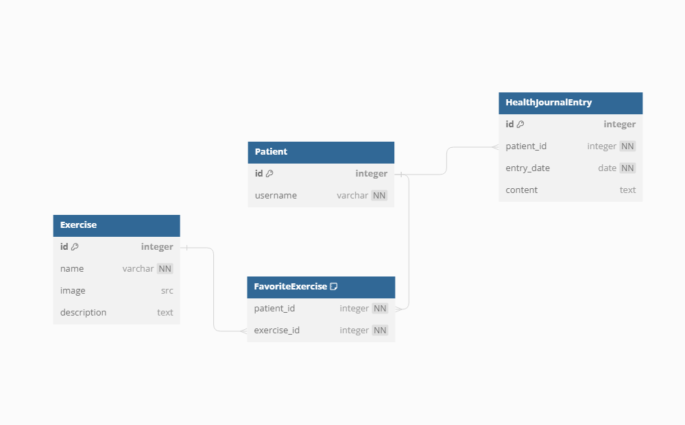

# Mendfinity

## Description
Digital portal designed for patients to discover targeted exercise plans, track health progress, manage their favorite rehabilitation exercises.

## User Stories
1. Patient can browse through a list of exercises.
2. Patient should be able to mark exercises as favorites and view them in dedicated section.
3. Patient should be able to log daily health and exercise activities in their personal journal.

## Wireframe of Homepage

## React Tree Diagram 

## React Router Routes & API Routes

## Screenshot of Schema

## New Technologies
Flask Sessions for user login/authentification.

## Stretch Goals
1. Make physical therapists users too.
2. Allow physical therapists to create workout templates.
3. Add a login feature for more user interaction.

## Kanban Board
